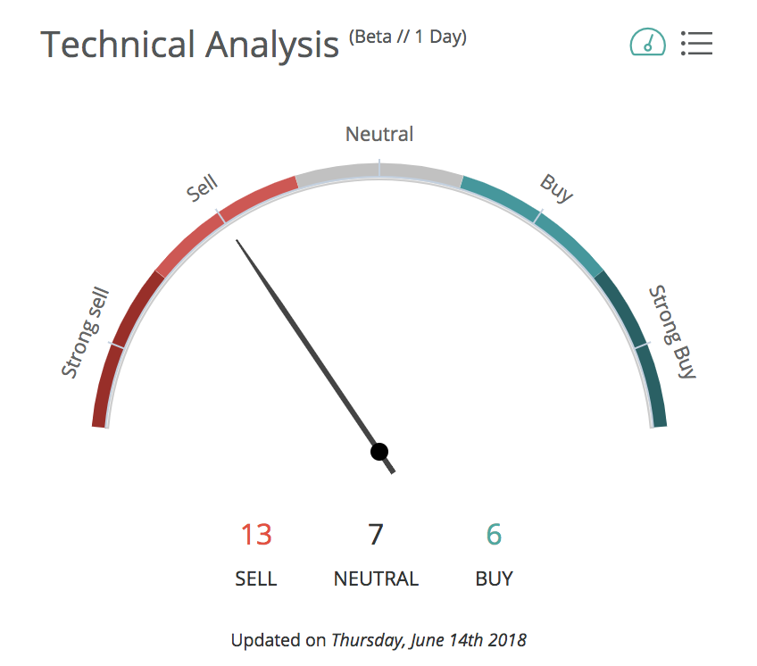
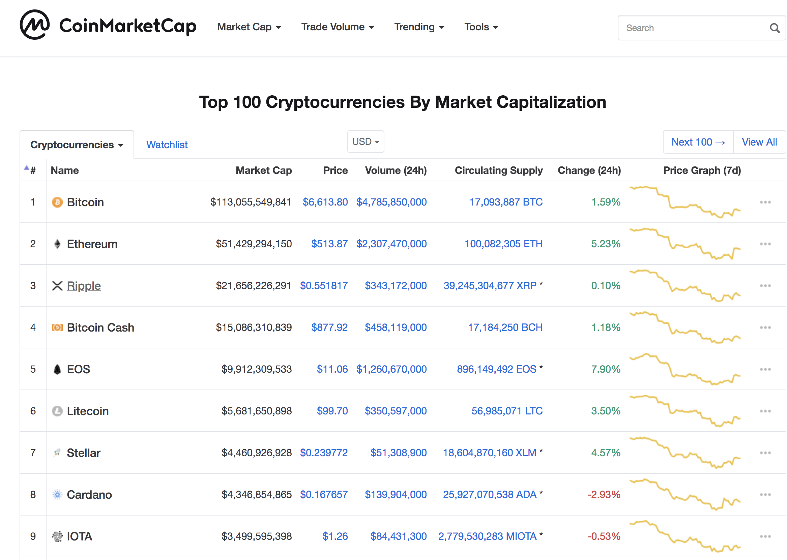
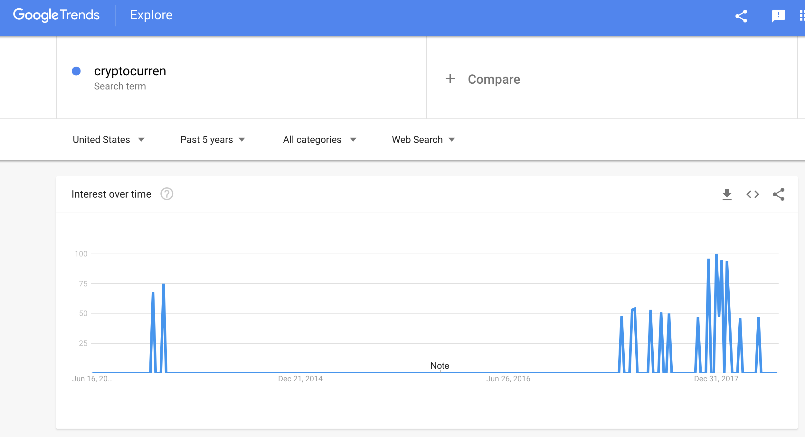
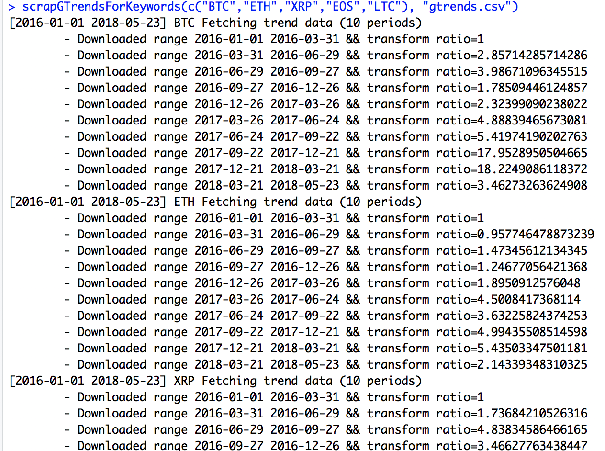

- BRETON Arthur
- GAMBOA Vinchi
- DORANGE Romain
- HU Clement
- LONGO Giuliano
- NATH VARMA Vitten

# Objectives

**Can we issue a buy/sell recommendation of cryptostock on a 7days holding period?**



# What is the relevant Data for our model ?

- Price 
- Volume
- Correlation
- Social Media
- Google Trends
- Utility Indicator

# Data Preparation

```{r include=FALSE}
rm(list=ls(all=TRUE)) # Remove everything from environment

# To automatically install require packages
if (!require(DBI)) install.packages("DBI")
if (!require(RSQLite)) install.packages("RSQLite")
if (!require(ggplot2)) install.packages("ggplot2")
if (!require(grid)) install.packages("grid")
if (!require(corrplot)) install.packages("corrplot")
if (!require(zoo)) install.packages("zoo")
if (!require(magrittr)) install.packages("magrittr")

# Check if you have universal installer package, install if not
if("pacman" %in% rownames(installed.packages()) == FALSE){
  install.packages("pacman")
} 

# devtools::install_github("PMassicotte/gtrendsR")
#Check, and if needed install the necessary packages
pacman::p_load("TTR","xts","gtrendsR","caret","ROCR","lift","glmnet","MASS", "partykit", "tidyverse", "scales", "xts", "grid", "gridExtra", "smooth", "Mcomp", "psych", "plyr","ggplot2", "forecast","knitr","kableExtra","rpart","e1071","lubridate", "magrittr", "DBI","corrplot", "zoo","gtable") 

# Make sure to use identitcal seed for reproductible results
set.seed(1234)

source("tools.R")
source("scrapper.R")
```

We used an external Python script to scrape the website www.coinmarketcap.com



Besides technical analysis on the stock, we also wanted to include a trend factor with our data so we looked at Google Trend.



Our hypothesis was that there is a strong correlation between google searches and stock prices.

### Feature Overview

- Volume 
- Momemtum 
- Volatility 
- Trend
- Buy / Sell classifier

### Downloading Data

After scrapping coinmarketcap website, we had the following data:

```{r echo=FALSE, warning=FALSE}
# Import from sqlite
con <- dbConnect(RSQLite::SQLite(), dbname='database.db') # Database connection
currencies <- dbGetQuery(con, "SELECT * FROM currency") # Import currencies
vals <- dbGetQuery(con, "SELECT * FROM val") # Import values
rm(con) # Close database connection

google.trends = read.csv("gtrends.csv")
google.trends$datetime = as.Date(google.trends$datetime)

currencies

# knitr::kable(currencies, caption = "Currencies", align = 'c')  %>%
#   kable_styling(bootstrap_options = c("striped", "hover", "condensed", "responsive")) %>%
#   column_spec(1, bold = T, border_right = T, width = "200px")  %>%
#   row_spec(11:11, bold = T, color = "white", background = "#D7261E")

head(vals, 3)
```

We also managed to download google data using a specific R library.

```{r eval = FALSE}
scrapGTrendsForKeywords(c("BTC","ETH","XRP","EOS","LTC"), "gtrends.csv")
```

```{r echo=FALSE}
head(google.trends)
```

Atht he moment we are unable to sort our currency by market cap.

### Cleanup data

- Remove unused IDs
- Format Dates
- Interpolate missing data 
    - Locate missing dates, insert row, and interpolate values

```{r include=FALSE}
# Clean and prepare data
vals$id = NULL # Drop database IDs
currencies$id = NULL # Drop database IDs
vals$datetime <- as.Date(vals$datetime) # Format dates
vals <- vals[!duplicated(vals[,6:7]),] # Remove duplicates/one price per day
vals <- interpolate.missing.data(vals) # For missing dates, insert fields and interpolate values (takes some time)
```

### Visualize initial Data

```{r}
plotGTrends(google.trends)
```


# Feature Engineering

We build these categorical variables on different lag periods:

- 7 days
- 14 days
- 21 days

### Create Overall Market statistics

The initial part of the analysis is to be able to create a new dataframe that will contain the total history of the market and useful indicators for technical analysis.

- Total market Cap daily
- Volatility 7d, 30d, 90d
- returns + logreturns
- Volume

```{r echo=FALSE, warning=FALSE}
### Calculate overall market statistics
market <- market.data(vals)
plot.market(market)

# Fetch latest market capitalisation per currency
latestMarketCapPerCurrency = function(x) {
  vals[vals$currency_slug==x & vals$datetime==max(vals[vals$currency_slug==x,]$datetime),]$market_cap_usd
}

# Sort the currencies by market value
currencies$mcap = NULL
currencies$mcap <- sapply(currencies$slug, FUN=latestMarketCapPerCurrency)
currencies <- currencies[order(currencies$mcap,currencies$slug, decreasing=TRUE),]; 
order(currencies$mcap,currencies$slug, decreasing=TRUE)
rownames(currencies) <- 1:nrow(currencies) # Sort

# Calculate returns for all values
vals$return <- Reduce(c,sapply(unique(vals$currency_slug), FUN=function(x) c(0,diff(vals[vals$currency_slug==x,]$price_usd)/(vals[vals$currency_slug==x,]$price_usd)[-length(vals[vals$currency_slug==x,]$price_usd)])))
vals$logreturn <- Reduce(c,sapply(unique(vals$currency_slug), FUN=function(x) c(0,log(vals[vals$currency_slug==x,]$price_usd[-1]/vals[vals$currency_slug==x,]$price_usd[-length(vals[vals$currency_slug==x,]$price_usd)]))))

# Compute betas
currencies$beta <- sapply(currencies$slug, FUN=currency.beta, vals[vals$datetime>as.Date("2016-12-31"),], market)

```

```{r echo=FALSE, message=FALSE, warning=FALSE}
knitr::kable(currencies, caption = "", align = 'c')  %>% 
  kable_styling(bootstrap_options = c("striped", "hover", "condensed", "responsive")) 
```

### "Scaled" Google Trends 

- Google only provide daily data up to 3months (automatically switch to weekly above 3months range)
- Data provided is "scaled" relative to the period (meaning 1-100 on each period instead of absolute value)

```{r}
plotGTrendsIssue(google.trends)
```



### Volume

Represent the average volume for a period:

- volume.7d
- volume.14d
- volume.21d

### Volatility

Standard deviation of the returns for a period:

- volatility.7d
- volatility.14d
- volatility.21d

### Momemtum

Score representing the delta of Upwards VS Downwards returns.

- momentum.7d
- momentum.14d
- momemtum.21d

### Trends

Linear regression of the Trends for a period from which we extract the coeeficient.

- trends.7d
- trends.14d
- trends.21d

### Buy / Sell Classifier

Starting from a specific day, we look back at a period returns to determine if we should have issued a buy or sell. This will allow us to test our model.

- buy.7d
- buy.14d
- buy.21d

## Putting it together

We are able to define the state of the market by mixing different features together. For example, we can determine how bullish/bearish a market is by multiplying our trend coefficient with the momentum. 


```{r warning=FALSE}
btcValues = coinDataEngineering("BTC")
ethValues = coinDataEngineering("ETH")
xrpValues = coinDataEngineering("XRP")
ltcValues = coinDataEngineering("LTC")
eosValues = coinDataEngineering("EOS")
```

# Techincal Analysis

```{r echo=FALSE, message=FALSE, warning=FALSE}
corrplot(cor(analysis.return.data(currencies[1:25,]$slug,vals[vals$datetime>as.Date("2016-12-31"),])[,-1],
             use = "pairwise.complete.obs"), method="ellipse")
plot.beta.vs.mcap.num(20, currencies)
```

```{r echo=FALSE, warning=FALSE}
slugs = c("bitcoin","ethereum", "ripple", "litecoin", "eos")
plot.currencies(vals, slugs)
plot.beta.timeline(slugs, 30, 90, vals, market)
```


```{r warning=FALSE, include=FALSE}
btcResults = doLogisticReg(btcValues)
ethResults = doLogisticReg(ethValues)
xrpResults = doLogisticReg(xrpValues)
ltcResults = doLogisticReg(ltcValues)
eosResults = doLogisticReg(eosValues)
```

## Logistic Regression

**buy.7 ~ volume.7 + volume.14 + volume.21 + volatility.7 + volatility.14 + volatility.21 + momentum.7 +  momentum.14 + momentum.21 + gtrend.7 + gtrend.14 + gtrend.21**

```{r eval = FALSE}
model = buy.7 ~ volume.7 + volume.14 + volume.21 + volatility.7 + volatility.14 + volatility.21 + momentum.7 +  momentum.14 + momentum.21 + gtrend.7 + gtrend.14 + gtrend.21
  # Train our model first
  logistic_reg = glm(model, data=training, family="binomial"(link="logit"))
  
btcResults = doLogisticReg(btcValues)
ethResults = doLogisticReg(ethValues)
xrpResults = doLogisticReg(xrpValues)
ltcResults = doLogisticReg(ltcValues)
eosResults = doLogisticReg(eosValues)
```

### Bitcoin
```{r echo=FALSE, warning=FALSE}
plotCoinData(btcValues)
plotLogisticReg(btcResults)
```

### Ethereum
```{r echo=FALSE, warning=FALSE}
plotCoinData(btcValues)
plotLogisticReg(btcResults)
```

### Ripple
```{r echo=FALSE, warning=FALSE}
plotCoinData(xrpValues)
plotLogisticReg(xrpResults)
```

### EOS
```{r echo=FALSE, warning=FALSE}
plotCoinData(eosValues)
plotLogisticReg(eosResults)
```

### Litecoin
```{r echo=FALSE, warning=FALSE}
plotCoinData(ltcValues)
plotLogisticReg(ltcResults)
```

# Summary Results
```{r echo=FALSE}
results = list(btcResults, ethResults, xrpResults, ltcResults, eosResults)
df = compareResults(results)

knitr::kable(df, caption = "", align = 'c')  %>% 
  kable_styling(bootstrap_options = c("striped", "hover", "condensed", "responsive")) %>% 
  column_spec(1, bold = T, border_right = T)
```

# Going Further

We have built a solid base to complete a better analysis in the future. Here is a list of topics we can investigate building on our current status:

+ Use probability to have categorized recommendation (Strong buy, Strong sell, neutral, ...) 
+ Portfolio Management / Optimization
    - Instead of choosing top 5 by market cap, analysis can be updated daily/hourly on all top currencies
    - Portfolio rebalancing
+ Identitfy arbitrage opportunities
+ Dynamic Horizons (already ready for 7,14,21 days)

